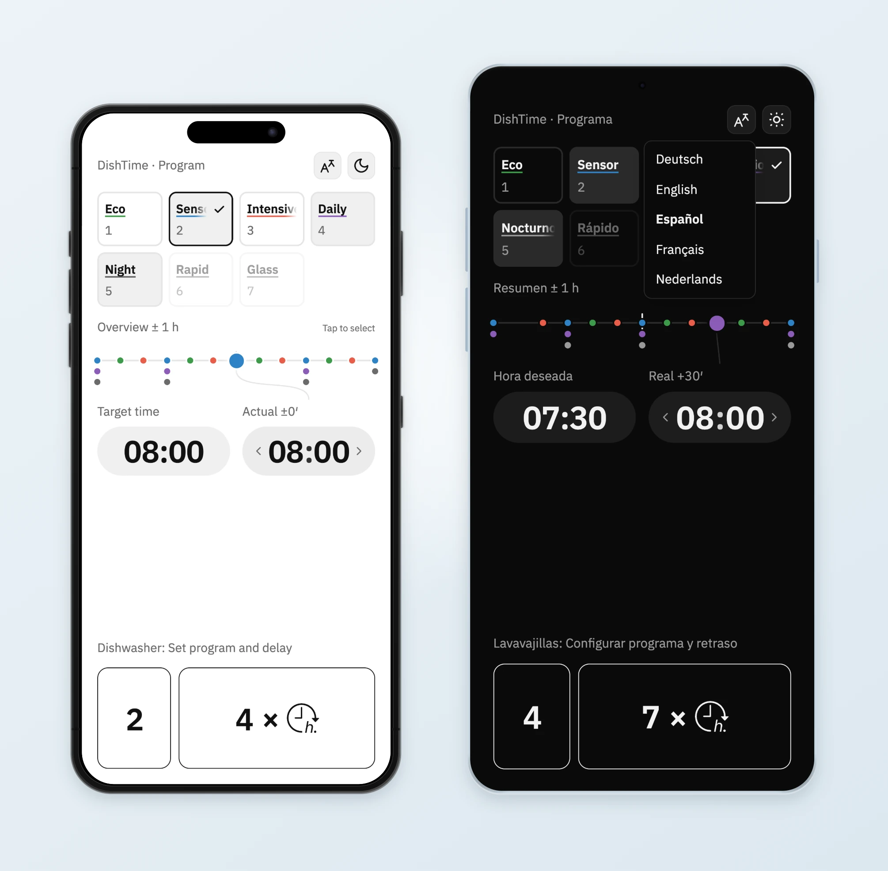

# DishTime

DishTime turns a desired finish time into the right delayed-start setting for a dishwasher. It removes the guesswork when the machine lets you delay the start, but not choose when the cycle should finish.

[Open DishTime](https://myhd.github.io/bk-dish-time-optimizer/)

  

Device frame based on <a href="https://github.com/mbdev3/react-mockframe">react-mockframe</a> · <a href="assets/readme/react-mockframe-LICENSE.txt">MIT license</a>

## What it does

- Finds the closest available finish time for the selected program.
- Shows the delay setting and number of button presses.
- Makes alternative programs and finish times easy to compare.
- Supports Deutsch, English, Español, Français, and Nederlands.

## Where it runs

DishTime is a small client-side web app for modern mobile and desktop browsers. It needs no account or backend and can be added to a phone's home screen.

The included machine profile is configured for a Bauknecht dishwasher. Program durations and delay steps can be adapted in [`machine-config.js`](machine-config.js).
